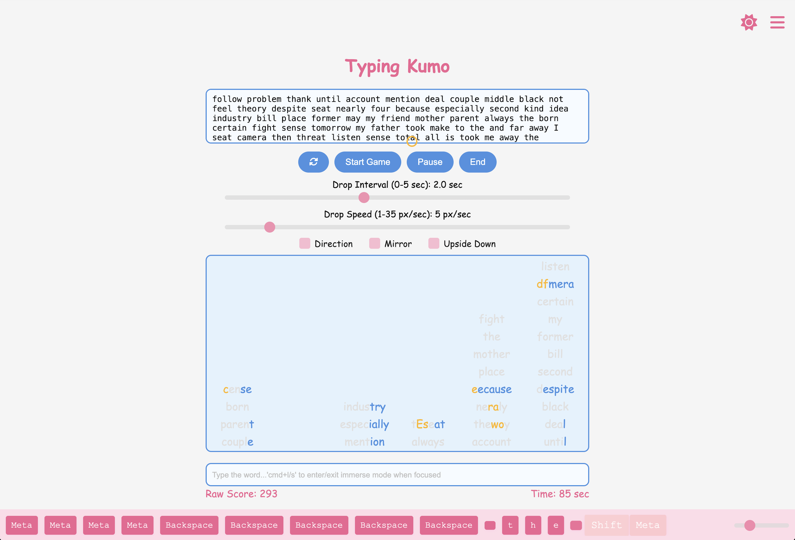

# Typing Kumo

'Kumo' comes from the Japanese word 'Cloud' ... but is it truly so pure and innocent?
There might be something lurking in ...



##  How to play

Glad you find it! Since this project is still at its starting point,
here's what you need to do to run the game:

1.  **Download the Project**

- Download the ZIP file from the repository or release section, or you can use the following commands:
	```bash
	cd path\to\where-you-want-to-keep-this-project
	git clone https://github.com/AAsteria/Typing-Kumo.git
	```

- Right-click the ZIP file and select **"Extract All"**. Extract it to your desired folder. Check the folder to ensure you have all required files to run the game as they are listed in Github repo.

2.  **Install Node.js**

- Download and install `Node.js` from [Node.js](https://nodejs.org).

- Open **Terminal** or **PowerShell** or **Command Prompt** (based on your operation system) and verify the installation:

	```bash
	node -v
	npm -v
	```
3.  **Navigate to the Project Folder**
- Open **Command Prompt** or **PowerShell**, type:

	```bash
	cd path\to\Typing-Kumo-main
	```
	 If you don't know how to find the correct path, you can simply type `cd` and a space(` `), then drag the folder you just extracted into your Command Prompt or PowerShell.

4. **Install Dependencies**
- In the project folder, run:
	```bash
	npm install
	```
5. **Run the Server**  
- After the dependencies are installed, start the server by typing:

	```bash
	node server.js
	```
	 you should see: 
	 ```bash
	 Server is running on http://localhost:3000
   ```
6. **Open the Game and Play**
- Open your browser (don't close the running server) and go to:
	```bash
	http://localhost:3000
	```
  Enjoy playing!

##  Contributing

Welcome to add any **serious** or **mischievous** features to Kumo!

Whether it's a brilliant idea or a quirky Easter egg, feel free to submit a Pull Request.

Let's make typing practicing more diverse and fun!

##  Note

This is an **inspiration-driven** project, not a technical one. A large portion of the code is generated by AI, no need to worry about its elegance or performance. 